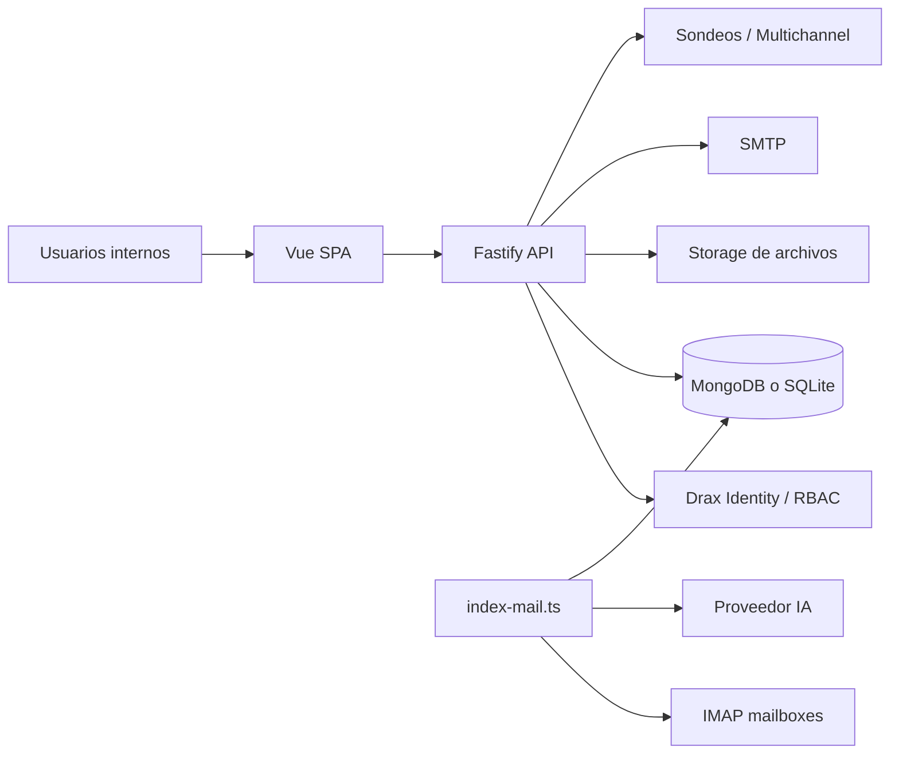
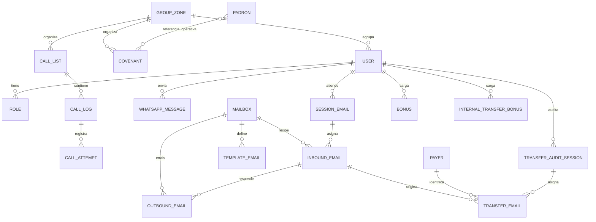
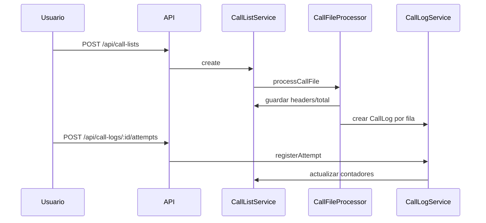
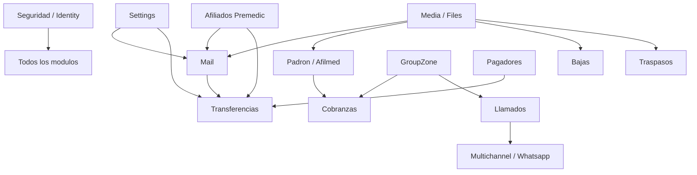

# Cobranzas Premedic - Documentacion funcional y tecnica de alto nivel

## 1. Descripcion general

Cobranzas Premedic es una plataforma interna para digitalizar y ordenar la operacion de cobranzas y procesos relacionados de Premedic. El sistema reemplaza planillas y tareas descentralizadas por una aplicacion web con usuarios, roles, permisos, tableros, importaciones, exportaciones, gestion de llamadas, casillas de correo compartidas, transferencias, cobranzas a domicilio, bonificaciones y soporte administrativo.

El objetivo principal es que las areas de Cobranzas y Bajas puedan distribuir trabajo, registrar gestiones, medir actividad, procesar informacion entrante y reducir operaciones manuales aisladas.

Usuarios principales informados como contexto: Operador, Cobrador, Supervisor y Administrador. En el codigo aparecen roles de sistema mas concretos: `Admin`, `Cobrador`, `Llamador`, `OperadorBaja` y `SupervisorBaja`.

Capacidades principales detectadas:

- Gestion de cobranzas a domicilio mediante convenios.
- Gestion de padron/deuda importado desde archivos.
- Gestion de listados de llamadas, intentos, tipificaciones y promesas de pago.
- Envio de plantillas WhatsApp mediante Sondeos/Multichannel.
- Gestion centralizada de casillas de mail compartidas.
- Sincronizacion de correos por IMAP, almacenamiento de adjuntos, OCR y clasificacion con IA.
- Procesamiento de correos de transferencias y auditoria humana de comprobantes.
- Gestion de bonificaciones del area de bajas y traspasos internos.
- Administracion de usuarios, roles, permisos, auditoria, configuracion, archivos y logs de IA.
- Backups/restores de datos y archivos.

## 2. Alcance funcional

- Administracion de seguridad: usuarios, roles, sesiones, API keys, intentos fallidos, permisos RBAC.
- Administracion de configuracion general y parametros operativos.
- Administracion de zonas/grupos de cobranza.
- Gestion de padron Afilmed/Premedic con datos de afiliados, deuda, contacto y medios de pago.
- Gestion de afiliados y tipos de afiliado.
- Gestion de convenios/cobranzas a domicilio.
- Importacion de listados de llamadas desde Excel y seguimiento operativo de cada contacto.
- Registro de intentos de llamada, resultado, notas, tipificacion, promesa de pago y cierre.
- Envio y trazabilidad de mensajes WhatsApp por plantilla.
- Gestion de casillas de correo, operadores habilitados, reglas de cierre, categorias, prioridades y analisis IA.
- Atencion de emails como cola de trabajo con asignacion manual o automatica.
- Respuesta, reenvio, envio nuevo y cierre de gestiones por mail.
- Supervision de actividad diaria/mensual/live en mailboxes.
- Procesamiento automatico/manual de correos de transferencias.
- Auditoria por sesiones de transferencias con asignacion temporal de casos.
- Gestion de movimientos bancarios y pagadores.
- Gestion y exportacion de bonificaciones por bajas y traspasos internos.
- Recuperacion, dump y restore de base de datos y archivos.

## 3. Arquitectura general

El proyecto es un monorepo con arquitectura frontend + API y organizacion modular por dominio funcional.

- `front/`: SPA Vue 3 con Vuetify, Vue Router, Pinia, i18n y componentes/cruds provistos por Drax.
- `back/`: API Fastify en TypeScript. Expone rutas REST, usa middlewares JWT, API Key y RBAC de `@drax/identity-back`, y registra modulos Drax mas modulos propios.
- `arch/`: paquete de arquitectura basado en `@drax/arch`.
- Base de datos: MongoDB como motor principal configurado por defecto; tambien existen repositorios SQLite para varias entidades y `DRAX_DB_ENGINE` permite seleccionar motor.
- Archivos/media: soporte de uploads y metadatos mediante `@drax/media-back`.
- Procesos independientes: ademas del servidor API, existe `back/src/index-mail.ts`, que inicializa sincronizacion de emails y procesamiento automatico de transferencias.
- Procesamiento asincronico: no se detectaron colas externas; se usan timers con `setInterval`, locks/campos de estado y procesamiento por lotes.
- Integraciones: Google SSO, IMAP/SMTP, IA via Drax AI provider, Sondeos/Multichannel para WhatsApp, OCR/PDF para adjuntos.

## 4. Modulos funcionales

### 4.1 Seguridad y administracion

#### Objetivo

Centralizar autenticacion, autorizacion, roles, usuarios, configuracion, auditoria, archivos y operaciones administrativas.

#### Funcionalidades

- Administracion de usuarios, roles, tenants, API keys, sesiones e intentos fallidos mediante rutas Drax Identity.
- Inicializacion de permisos propios y de librerias Drax.
- Creacion de usuario root, rol Admin y roles funcionales del sistema.
- Configuracion de parametros operativos desde `InitializeSettings`.
- Auditoria y logs de IA mediante modulos Drax.
- Backup/restore de base de datos y archivos desde el modulo Recovery.
- Endpoint de salud `GET /api/health`.

#### Entidades principales

**Usuario**

Proposito: representa una cuenta autenticada que opera el sistema.

Informacion principal:

- nombre/username/email;
- roles y permisos;
- sesiones y API keys.

Relaciones:

- puede tener roles;
- puede crear bonificaciones, gestionar llamadas, atender mailboxes o auditar transferencias.

**Rol**

Proposito: agrupa permisos para perfiles funcionales.

Informacion principal:

- nombre;
- permisos;
- marca `readonly` para roles de sistema.

Estados: no se detecto ciclo de vida funcional mas alla de existencia/configuracion.

**Configuracion**

Proposito: guarda parametros operativos de la aplicacion.

Informacion principal:

- `AppName`;
- `MailboxAutoSync`;
- `MailboxAutoPurge`;
- `InboundMailTransferAutoProcess`;
- `InboundMailTransferCategory`.

Relaciones:

- el worker de mails y transferencias lee estas configuraciones para decidir si ejecuta tareas automaticas.

#### Procesos principales

1. Al iniciar backend, `SetupDrax` carga configuracion desde variables de entorno.
2. Si el motor es MongoDB, abre conexion Mongoose.
3. Registra permisos de Drax y permisos locales.
4. Inicializa auditoria, settings, usuario root y roles del sistema.
5. Ejecuta scripts de migracion/normalizacion de emails cuando el motor es MongoDB.

#### Reglas de negocio relevantes

- Todas las rutas API pasan por middlewares JWT, API Key y RBAC.
- El rol `Admin` recibe todos los permisos disponibles.
- La politica de passwords se configura desde `PasswordPolicy`.

#### Integraciones

- Drax Identity, Audit, Settings, Media, Dashboard y AI.
- Google SSO en modulo Google.

#### Observaciones

- Los roles informados por contexto no coinciden exactamente con los roles persistidos por codigo. `Operador` y `Supervisor` aparecen como conceptos funcionales, pero los roles concretos son mas especificos.

### 4.2 Cobranzas a domicilio / Convenios

#### Objetivo

Gestionar convenios o tareas de cobranza asociadas a afiliados/deudores, montos, periodos y zonas/grupos.

#### Funcionalidades

- Alta, consulta, actualizacion y baja de convenios.
- Exportacion general y exportacion Excel filtrada por fecha y grupo.
- Dashboard frontend de convenios.
- Administracion de zonas/grupos relacionados con la distribucion de trabajo.

Quien puede ejecutarlas: usuarios con permisos `covenant:*` y `groupzone:*`; el rol `Cobrador` tiene permisos amplios sobre convenios y vista de grupos.

#### Entidades principales

**Covenant / Convenio**

Proposito: representa una cobranza/convenio a gestionar.

Informacion principal:

- fecha;
- periodo desde/hasta y mes;
- nombre completo y DNI;
- localidad y domicilio;
- monto;
- grupo/zona;
- usuario creador/actualizador;
- estado;
- comentario y motivo de rechazo.

Relaciones:

- pertenece a un grupo/zona;
- registra creador, actualizador y eventualmente usuario que rechazo.

Estados:

`activo` o `rechazado`.

**GroupZone / Grupo-Zona**

Proposito: agrupa usuarios o zonas para distribuir cobranzas y listas de llamadas.

Informacion principal:

- nombre;
- usuarios vinculados.

Relaciones:

- usado por convenios;
- usado por listados de llamadas para filtrar visibilidad por grupo.

#### Procesos principales

1. Un usuario carga o actualiza un convenio con datos de afiliado/deuda/domicilio.
2. El sistema valida campos obligatorios y monto no negativo.
3. El convenio queda asociado a un grupo.
4. Se consulta desde CRUD, dashboard o exportacion.
5. Puede marcarse rechazado con comentario y usuario responsable.

#### Reglas de negocio relevantes

- `since`, `until`, `month`, `fullname`, `dni`, `locality`, `address`, `group` y `amount` son obligatorios.
- El estado solo admite `activo` o `rechazado`.
- La exportacion Excel requiere fecha y grupo.

#### Integraciones

No se detectan integraciones externas propias del modulo.

#### Observaciones

- En frontend el menu aparece como "Cobranzas"; en backend el modulo tecnico se llama `collections`.

### 4.3 Afilmed / Padron

#### Objetivo

Mantener o consultar un padron importado con informacion de afiliados, deuda, contacto, plan, domicilio y medios de pago.

#### Funcionalidades

- CRUD de registros de padron.
- Importacion de archivos `.xlsx` o `.csv` almacenados previamente.
- Exportacion del padron.
- Consulta/busqueda para soporte de cobranzas y llamados.

Quien puede ejecutarlas: usuarios con permisos `padron:*`; el rol `Cobrador` tiene manage/create/view/update/delete.

#### Entidades principales

**Padron**

Proposito: representa un registro de afiliado/deudor proveniente del padron operativo.

Informacion principal:

- origen;
- ente;
- contrato;
- apellido y nombre;
- cantidad de integrantes;
- plan;
- domicilio/localidad/provincia;
- telefono/celular;
- deudas y periodos;
- subtotal y total de cuenta corriente;
- forma de pago;
- cobrador;
- fecha de baja;
- referencia electronica;
- alias y CBU SIRO.

Relaciones:

- se usa como fuente de datos para gestiones de cobranza, llamadas y posiblemente identificacion de afiliados.

Estados:

- No se detecta estado funcional explicito.

#### Procesos principales

1. El usuario sube un archivo por media/upload.
2. Ejecuta importacion del padron con `POST /api/padrones/import-file`.
3. El servicio lee el archivo y crea/actualiza registros.
4. Los datos quedan disponibles para busquedas, cruds y exportaciones.

#### Reglas de negocio relevantes

- Para importar debe existir `file.filepath`.
- `contra` y `ape_nom` son obligatorios.

#### Integraciones

- Procesamiento de archivos Excel/CSV.
- Media/upload Drax para almacenar el archivo antes de importarlo.

#### Observaciones

- El nombre `Afilmed` aparece como modulo frontend/backend, pero el objetivo exacto de negocio debe validarse con responsables.

### 4.4 Premedic / Afiliados

#### Objetivo

Administrar informacion base de afiliados Premedic y tipos de afiliado para usarla como referencia en procesos de transferencias, cobranzas y datos del cliente.

#### Funcionalidades

- CRUD de afiliados.
- CRUD de tipos de afiliado.
- Comboboxes/proveedores frontend para seleccion en otros modulos.

Quien puede ejecutarlas: usuarios con permisos `affiliate:*` y `affiliatetype:*`; por menu queda principalmente bajo Administracion/Premedic.

#### Entidades principales

**Afiliado**

Proposito: representa una persona afiliada o asociada a un titular.

Informacion principal:

- apellido y nombre;
- DNI;
- CUIL/CUIT;
- tipo;
- titular;
- DNI del titular.

Relaciones:

- puede referenciar otro afiliado como titular;
- se utiliza desde el procesamiento de correos para detectar cliente/afiliado.

Estados:

- No se detecta ciclo de vida funcional.

**Tipo de afiliado**

Proposito: clasifica afiliados.

Informacion principal:

- nombre;
- descripcion.

#### Procesos principales

1. Un administrador carga tipos de afiliado.
2. Se registran afiliados con identificadores y titular.
3. Otros modulos consultan estos datos para completar o validar gestiones.

#### Reglas de negocio relevantes

- `apellidoNombre`, `dni` y `titularDni` son obligatorios.

#### Integraciones

No se detectan integraciones externas propias.

#### Observaciones

- Existe tambien `Padron`, que contiene informacion parecida pero orientada a importacion operativa. Conviene validar si `Affiliate` es maestro interno y `Padron` es fuente externa/importada.

### 4.5 Llamados

#### Objetivo

Gestionar campanas/listados de llamadas y registrar gestiones telefonicas de cobranzas con metricas de intentos, resultados, promesas y cierres.

#### Funcionalidades

- Crear listados de llamadas con archivo Excel.
- Procesar cada fila del Excel como un registro de llamada (`CallLog`) con datos dinamicos.
- Consultar listados visibles por usuario o grupo.
- Atender una lista desde pantalla de agente.
- Registrar intentos de llamada, notas, tipificacion, resultado y promesa de pago.
- Mantener contadores por listado: total, intentos, fallidas, exitosas, promesas y control por numero de intento.
- Buscar dentro de los datos importados usando headers dinamicos.
- Exportar resultados a Excel cuando el listado es exportable.
- Administrar tipificaciones de exito y fallo.
- Enviar mensajes WhatsApp por plantilla y registrar trazabilidad.

Quien puede ejecutarlas: `Llamador` ve listas/logs/intentos y envia WhatsApp; `Cobrador` tiene permisos similares y acceso a mas modulos. Usuarios con `calllist:viewAll` pueden ver todos los listados.

#### Entidades principales

**CallList / Listado de llamadas**

Proposito: representa una campana o lote de contactos a gestionar telefonicamente.

Informacion principal:

- nombre;
- grupo;
- usuario asignado;
- archivo importado;
- estado;
- total de registros;
- contadores de intentos, exitos, promesas y fallos;
- fecha limite;
- headers del archivo;
- marca exportable.

Relaciones:

- pertenece a un usuario o grupo/zona;
- contiene muchos `CallLog`.

Estados:

`PREPARANDO` -> `EN_CURSO` -> `FINALIZADO` / `ARCHIVADO` / `VENCIDO`.

**CallLog / Gestion de llamada**

Proposito: representa una fila/contacto del listado y su estado de gestion.

Informacion principal:

- listado asociado;
- datos dinamicos importados;
- cantidad de intentos;
- notas;
- tipificacion;
- estado;
- fecha de promesa;
- gestionado.

Relaciones:

- pertenece a un `CallList`;
- genera registros `CallAttempt`.

Estados:

`pendiente`, `intentada`, `fallida`, `promesa`, `exitosa`.

**CallAttempt / Intento de llamada**

Proposito: registra cada intento realizado por un usuario.

Informacion principal:

- fecha;
- usuario;
- resultado;
- nombre de listado;
- referencia al CallLog.

**CallSuccessType / CallFailedType**

Proposito: catalogos de tipificaciones posibles para llamadas exitosas o fallidas.

**WhatsappMessage**

Proposito: audita mensajes WhatsApp enviados desde el sistema.

Informacion principal:

- fecha de envio;
- usuario;
- numero destino;
- template.

#### Procesos principales

1. Un supervisor/administrador crea un `CallList` con archivo Excel.
2. `CallListService.onCreated` dispara `CallFileProcessor`.
3. El procesador toma la primera fila como headers y cada fila siguiente como `CallLog.data`.
4. Actualiza el listado con `headers`, `total` y estado `EN_CURSO`.
5. El operador abre la pantalla de agente para una lista.
6. Registra un intento con resultado, notas y posible promesa.
7. El sistema incrementa intentos, actualiza contadores del listado y crea un `CallAttempt`.
8. Si corresponde, el usuario envia una plantilla WhatsApp por Sondeos/Multichannel.

#### Reglas de negocio relevantes

- La busqueda por datos dinamicos requiere filtro de `callList`; sin listado no puede determinar que headers buscar.
- La exportacion Excel de llamadas exige que el listado tenga `isExportable = true`.
- Los usuarios con solo `calllist:view` ven listados asignados a ellos o a grupos donde participan; la vista global requiere `calllist:viewAll`.
- Cuando el resultado es `promesa`, si no hay tipificacion se usa "Promesa de pago" y se conserva `promiseDate`; si no, `promiseDate` se limpia.

#### Integraciones

- ExcelJS para importar/exportar listados.
- Sondeos/Multichannel para WhatsApp.

#### Observaciones

- No se detecto worker externo para procesar listados; el procesamiento se dispara en memoria tras crear el listado.

### 4.6 Mail / Gestion de casillas compartidas

#### Objetivo

Convertir casillas corporativas compartidas en colas de trabajo asignables, medibles y trazables. Permite traer emails, clasificarlos, asignarlos, responderlos, cerrarlos y supervisar actividad por operador.

#### Funcionalidades

- Configurar mailboxes con credenciales, IMAP/POP/SMTP, operadores, categorias, motivos de cierre, prioridades, sentimientos, entidades, tags y reglas de gestion.
- Sincronizar correos entrantes manual o automaticamente.
- Almacenar adjuntos y extraer texto por PDF/OCR cuando esta habilitado.
- Analizar correos con IA para sugerir categoria, sentimiento, prioridad, resumen, cliente, tags y entidades extraidas.
- Gestionar correos desde vistas: pendientes, asignados a mi, asignados en atencion, asignados, cerrados, enviados y destacados.
- Tomar un correo, reasignarlo, clasificarlo, responderlo, reenviarlo, enviarlo nuevo, cerrarlo y reabrirlo.
- Iniciar, pausar, reanudar y cerrar sesiones de atencion por mailbox.
- Asignar automaticamente correos pendientes hasta la capacidad maxima del operador.
- Supervisar estado live, diario y mensual de operadores/casillas.
- Purga automatica por retencion configurada.

Quien puede ejecutarlas: operadores incluidos en cada mailbox y con permisos `inboundemail:*`, `mailbox:*`, `outboundemail:*`, `templateemail:*` y `sessionemail:*`. `Cobrador` puede operar inbound emails, ver mailboxes, crear outbound emails y gestionar templates parcialmente.

#### Entidades principales

**Mailbox**

Proposito: representa una casilla corporativa que el sistema gestiona.

Informacion principal:

- nombre, email, username y password;
- operadores autorizados;
- categorias y URL de gestion por categoria;
- motivos de cierre;
- entidades esperadas;
- sentimientos, prioridades y tags;
- reglas: IA habilitada, activo, auto process, respuesta obligatoria para cerrar, motivo obligatorio, adjuntos, OCR, retencion;
- conexion IMAP/POP/SMTP.

Relaciones:

- contiene correos entrantes/salientes;
- define operadores habilitados para gestionar esos correos.

Estados:

- activo/inactivo; no hay ciclo formal mas complejo.

**InboundEmail / Correo entrante**

Proposito: representa un email recibido convertido en caso gestionable.

Informacion principal:

- messageId/thread/references;
- mailbox y UID IMAP;
- canal fuente;
- fecha de recepcion;
- remitente/destinatarios;
- asunto/cuerpo;
- adjuntos y OCR;
- categoria, sentimiento, prioridad, tags, resumen;
- datos del cliente y entidades extraidas;
- estado de atencion, asignacion y cierre;
- estado de procesamiento IA/revision;
- marcas de proceso para tareas posteriores.

Relaciones:

- pertenece a un mailbox;
- puede estar asignado a un usuario y a una sesion;
- puede tener hilo entrante y correos salientes vinculados;
- puede originar `TransferEmail`.

Estados:

- Atencion: `PENDING` -> `ASSIGNED` -> `CLOSED`.
- Procesamiento: `PENDING`, `PROCESSING`, `PROCESSED`, `REVIEW_REQUIRED`, `REJECTED`, `ERROR`.
- Revision: `PENDING`, `APPROVED`, `REJECTED`, `CORRECTED`.
- Marcas de proceso por tarea: `PROCESSING`, `SUCCESS`, `FAILED`, `SKIPPED`.

**OutboundEmail / Correo saliente**

Proposito: registra respuestas, reenvios o emails nuevos enviados desde la plataforma.

Informacion principal:

- inbound vinculado opcional;
- mailbox;
- usuario;
- remitente y destinatarios;
- asunto/cuerpo;
- adjuntos;
- messageId, inReplyTo, references;
- estado, fecha de envio, errores e intentos.

Estados:

`DRAFT`, `QUEUED`, `SENDING`, `SENT`, `FAILED`, `CANCELLED`.

**SessionEmail / Sesion de atencion**

Proposito: representa el bloque de trabajo de un operador sobre un mailbox.

Informacion principal:

- mailbox;
- usuario;
- estado;
- inicio/pausa/fin;
- capacidad maxima;
- contadores de asignados, respondidos y cerrados.

Estados:

`ACTIVE`, `PAUSED`, `CLOSED`.

**TemplateEmail**

Proposito: plantillas reutilizables de respuesta por mailbox.

**MailboxUserSetting / EmailUserState**

Proposito: preferencias/estado por usuario, como destacados, lectura u opciones de mailbox.

#### Procesos principales

1. Un administrador configura un mailbox con operadores, categorias y conexiones.
2. Un operador inicia sesion de atencion.
3. El sistema asigna automaticamente correos pendientes hasta su capacidad configurada.
4. El operador abre un correo, revisa hilo, adjuntos, resumen IA y datos extraidos.
5. Puede responder, reenviar, reclasificar, cerrar o reabrir.
6. Al cerrar un correo asignado a una sesion activa, el sistema incrementa contador y repone capacidad con otro pendiente.
7. Supervisores consultan vistas live/diarias/mensuales por mailbox.

#### Reglas de negocio relevantes

- Solo operadores incluidos en el mailbox pueden gestionarlo.
- No se puede tomar un correo cerrado; tomar un correo ya asignado genera conflicto salvo modo forzado.
- Para cerrar una gestion, el correo debe estar asignado al usuario actual.
- Si el mailbox exige respuesta para cerrar, debe existir al menos una respuesta enviada.
- Si el mailbox exige motivo de cierre, debe indicarse un motivo.
- Una sesion abierta por usuario y mailbox no puede duplicarse.
- La asignacion automatica usa lock de 30 segundos para evitar carreras de capacidad.
- La IA no deberia usar informacion fuera del asunto, cuerpo, OCR de adjuntos y metadatos del remitente.

#### Integraciones

- IMAP mediante `imapflow` para lectura de casillas.
- SMTP mediante `@drax/email-back` para envio.
- Media Drax para adjuntos.
- PDF text extractor y Tesseract OCR.
- Drax AI provider, por defecto `OllamaAi`, con modelo resuelto desde `OPENAI_MODEL`/`OPENAI_DEFAULT_MODEL`.

#### Observaciones

- El schema contempla POP, pero el proveedor inspeccionado filtra y procesa IMAP. Hay que validar si POP esta implementado o pendiente.
- Existe documentacion especifica previa en `docs/module-mail.md` y un guion de capacitacion en `docs/module-mail-script.md`.

### 4.7 Transferencias

#### Objetivo

Procesar comprobantes o avisos de transferencias recibidos por mail, extraer datos relevantes, vincular pagadores/afiliados y someterlos a auditoria humana antes de darlos por validados, corregidos o descartados.

#### Funcionalidades

- Gestion de movimientos bancarios.
- Gestion de pagadores y estrategias de identificacion.
- Procesamiento manual o automatico de correos entrantes como transferencias.
- Extraccion de datos de transferencia mediante IA y fallback.
- Creacion de uno o mas registros de transferencia por correo.
- Reprocesamiento de transferencias para recalcular pagador/afiliados.
- Auditoria con sesiones, asignacion por lotes, heartbeat y vencimiento.
- Exportacion Excel de transferencias con detalle por afiliado.
- Cierre del email vinculado desde auditoria cuando corresponde.

Quien puede ejecutarlas: usuarios con `transferemail:*`, `transferauditsession:*`, `payer:*`, `bankmovement:*`. El rol `Cobrador` puede ver/gestionar/actualizar transferencias, auditar sesiones y administrar pagadores.

#### Entidades principales

**TransferEmail**

Proposito: representa una transferencia detectada desde un correo o cargada manualmente para revision.

Informacion principal:

- email/inbound de origen;
- pagador identificado;
- datos del remitente y documento detectado;
- si es comprobante de transferencia;
- importe, moneda y fecha;
- numero de operacion y concepto;
- datos de cuenta origen/destino;
- estrategia de afiliado/pagador;
- afiliados afectados con nombre, DNI, mes, monto y observaciones;
- estado IA, estado humano, estado general;
- asignacion/auditoria.

Relaciones:

- puede provenir de un `InboundEmail`;
- puede estar vinculado a un `Payer`;
- se asigna temporalmente a un operador dentro de una `TransferAuditSession`.

Estados:

- IA: `PENDIENTE`, `PROCESADO_CONFIABLE`, `PROCESADO_CON_DUDAS`, `PROCESADO_INCOMPLETO`, `PROCESADO_SIN_IA`, `ERROR_PROCESAMIENTO`.
- Humano: `PENDIENTE`, `VALIDADO`, `CORREGIDO`, `DESCARTADO`.
- General: `PENDIENTE_IA`, `PENDIENTE_AUDITORIA`, `AUDITADO`.

**TransferAuditSession**

Proposito: organiza el trabajo de auditoria de un operador con un lote asignado temporalmente.

Informacion principal:

- operador;
- estado;
- fecha de inicio, pausa, cierre y vencimiento;
- tamano de lote;
- contadores asignados, auditados, validados, corregidos, descartados.

Relaciones:

- asigna muchos `TransferEmail`.

Estados:

`ACTIVE`, `PAUSED`, `COMPLETED`, `EXPIRED`, `CANCELLED`.

**Payer**

Proposito: mapea identificadores de pagadores a afiliados.

Informacion principal:

- estrategia de busqueda;
- valor;
- afiliados asociados.

Estrategias:

`EMAIL_FROM`, `DNI_CUIL`, `CBU_CVU`, `NRO_CUENTA`.

**BankMovement**

Proposito: representa movimientos bancarios importables/consultables para conciliacion.

Informacion principal:

- fecha, concepto, comprobante;
- debito, credito, saldo;
- importe y direccion;
- tipo de concepto;
- banco/cuenta/pagador detectado;
- afiliado vinculado;
- estado.

Estados:

`pendiente`, `asignado`, `manual`, `ignorado`.

#### Procesos principales

1. El worker o un usuario selecciona correos `InboundEmail` procesados con categoria configurada.
2. `InboundMailTransferProcessor` descarta correos ya procesados o no relacionados.
3. Usa IA para detectar si el email es comprobante/aviso de transferencia y extraer datos.
4. Si la IA falla, crea un registro minimo manual para no perder el caso.
5. Marca el `InboundEmail` con `processMarks` para registrar resultado, intentos y errores.
6. Crea `TransferEmail` en estado pendiente de auditoria o pendiente IA segun los datos.
7. Un operador inicia una `TransferAuditSession`.
8. El sistema le asigna un lote con lease de 20 minutos y renueva con heartbeat.
9. El operador valida, corrige o descarta cada transferencia.
10. La transferencia queda `AUDITADO`; opcionalmente se cierra el email origen.

#### Reglas de negocio relevantes

- La automatizacion solo corre si `InboundMailTransferAutoProcess` esta activo.
- El filtro de categoria se toma de `InboundMailTransferCategory`.
- Se evitan duplicados buscando transferencias por `emailMessageId` e `inboundEmail`.
- Los emails fallidos pueden reintentarse hasta 2 veces para este proceso.
- Una transferencia con importe, fecha o DNI/afiliado faltante queda con revision humana requerida.
- La auditoria asignada rechaza actualizaciones si la asignacion vencio o corresponde a otro operador.
- Las sesiones de auditoria liberan pendientes al pausar/completar/vencer.

#### Integraciones

- Modulo Mail para leer `InboundEmail`.
- Drax AI provider.
- Configuracion Drax Settings.
- ExcelJS para exportacion.

#### Observaciones

- `BankMovement` existe como entidad y pantalla, pero no se encontro un flujo completo de conciliacion automatica con `TransferEmail` en el relevamiento.

### 4.8 Bajas / Bonificaciones

#### Objetivo

Registrar, seguir y exportar bonificaciones asociadas a procesos de bajas.

#### Funcionalidades

- CRUD de bonificaciones.
- Dashboard de bonificaciones.
- Importacion/exportacion.
- Exportacion Excel filtrada por rango de fechas y operador.
- Control de edicion segun permisos, creador y fecha.

Quien puede ejecutarlas: `OperadorBaja` puede crear/ver/actualizar y gestionar; `SupervisorBaja` puede ver todo, crear, actualizar y exportar.

#### Entidades principales

**Bonus / Bonificacion**

Proposito: representa una bonificacion solicitada o aplicada en proceso de baja.

Informacion principal:

- DNI;
- nombre completo;
- plan;
- mes de aplicacion;
- metodo de pago;
- bonificacion;
- periodo;
- valor neto bonificado;
- estado;
- observacion;
- usuario creador.

Relaciones:

- pertenece funcionalmente al usuario que la cargo.

Estados:

`Pendiente`, `Aplicado`, `No aplicado`.

#### Procesos principales

1. El operador carga una bonificacion.
2. El sistema fuerza estado inicial `Pendiente` y elimina observaciones de creacion.
3. El operador o supervisor actualiza estado.
4. Si se marca `No aplicado`, debe cargar observacion.
5. Se exportan bonificaciones por rango de fechas y opcionalmente operador.

#### Reglas de negocio relevantes

- Una bonificacion nueva siempre nace `Pendiente`.
- Usuarios sin permiso `bonus:manage` solo pueden editar sus propias bonificaciones creadas hoy.
- `No aplicado` exige observacion.
- Exportar Excel requiere `from` y `to`.

#### Integraciones

- Media para archivos si se usa importacion generica Drax.
- ExcelJS para exportacion Excel.

#### Observaciones

- La exportacion y permisos diferencian operador y supervisor.

### 4.9 Traspasos internos

#### Objetivo

Registrar, seguir y exportar bonificaciones derivadas de traspasos internos, incluyendo casos que requieren transferencia bancaria.

#### Funcionalidades

- CRUD de bonificaciones por traspaso interno.
- Dashboard y exportacion.
- Importacion/exportacion.
- Adjuntar datos bancarios cuando el tipo de bonificacion lo requiere.
- Control de edicion por permisos, creador y fecha.

Quien puede ejecutarlas: `OperadorBaja` y `SupervisorBaja` tienen permisos sobre `internaltransferbonus:*`; supervisor tambien posee permiso de exportacion.

#### Entidades principales

**InternalTransferBonus / Bonificacion por traspaso interno**

Proposito: representa una bonificacion vinculada a un traspaso interno.

Informacion principal:

- DNI;
- nombre completo;
- mes de aplicacion;
- valor bonificado;
- tipo de bonificacion;
- adjunto de datos bancarios;
- estado;
- observacion;
- usuario creador.

Relaciones:

- puede adjuntar archivo mediante media/upload.

Estados:

`Pendiente`, `Aplicado`, `No aplicado`.

Tipos:

`Credito en Cuenta Corriente`, `Transferencia Bancaria`.

#### Procesos principales

1. El operador carga una bonificacion por traspaso.
2. El sistema la crea como `Pendiente`.
3. Si el tipo es `Transferencia Bancaria`, exige adjunto bancario.
4. Al actualizar a `No aplicado`, exige observacion.
5. Supervisor/usuarios autorizados exportan por rango de fechas y operador.

#### Reglas de negocio relevantes

- Estado inicial forzado a `Pendiente`.
- `No aplicado` exige observacion.
- `Transferencia Bancaria` exige adjunto con `url` o `filepath`.
- Usuarios sin `internaltransferbonus:manage` solo editan registros propios del dia.

#### Integraciones

- Media/upload para adjuntos.
- ExcelJS para exportacion.

#### Observaciones

- El modulo esta separado de Bajas aunque comparte reglas y actores.

### 4.10 Notificaciones

#### Objetivo

Permitir notificaciones internas con estado de lectura.

#### Funcionalidades

- CRUD de notificaciones.
- Marcar estado leido/no leido.
- Pantalla de prueba de notificaciones en frontend.

#### Entidades principales

**Notification**

Proposito: representa un aviso interno del sistema.

Informacion principal:

- titulo/mensaje;
- tipo: `info`, `success`, `warning`, `error`;
- estado: `unread`, `read`;
- usuario o alcance segun implementacion Drax/local.

Estados:

`unread` -> `read`.

#### Procesos principales

1. Se crea una notificacion.
2. El usuario la consulta desde frontend.
3. Puede actualizarse el estado de lectura.

#### Observaciones

- No se detectaron productores automaticos de notificaciones en los procesos principales relevados.

## 5. Roles y usuarios

El sistema usa RBAC basado en permisos individuales. Cada ruta/controlador valida permisos con `request.rbac.assertPermission` o con el controlador CRUD de Drax. Los roles de sistema se crean al iniciar la aplicacion.

### Admin

**Objetivo**

Administrador total del sistema.

**Principales permisos**

Todos los permisos registrados en la aplicacion.

**Modulos a los que accede**

Todos: administracion, seguridad, cobranzas, llamados, mail, transferencias, bajas, traspasos, padron, afiliados, auditoria, settings y archivos.

### Cobrador

**Objetivo**

Usuario operativo de cobranzas con acceso a padron, convenios, llamados, WhatsApp, transferencias y gestion de mails.

**Principales permisos**

- Ver y administrar padron.
- Ver y administrar convenios.
- Ver grupos/zona.
- Ver listados y actualizar gestiones de llamada.
- Enviar WhatsApp por template.
- Ver/gestionar/actualizar transferencias y sesiones de auditoria.
- Administrar pagadores.
- Ver y gestionar correos entrantes, asignarse/reabrir/actualizar.
- Ver mailboxes, correos salientes y crear respuestas.
- Ver/crear/actualizar templates.

**Modulos a los que accede**

Cobranzas, Afilmed/Padron, Llamados, WhatsApp, Mail, Transferencias.

### Llamador

**Objetivo**

Operador especializado en gestion telefonica.

**Principales permisos**

- Ver grupos/zona.
- Ver listados de llamada.
- Ver y actualizar gestiones de llamada.
- Ver intentos.
- Enviar WhatsApp por template.
- Ver tipificaciones de exito/fallo.

**Modulos a los que accede**

Llamados y WhatsApp.

### OperadorBaja

**Objetivo**

Operador del area de Bajas que carga y actualiza bonificaciones.

**Principales permisos**

- Gestionar, crear, ver y actualizar bonificaciones de bajas.
- Gestionar, crear, ver y actualizar bonificaciones de traspasos internos.
- Subir/ver archivos.

**Modulos a los que accede**

Bajas, Traspasos Internos, archivos/media.

### SupervisorBaja

**Objetivo**

Supervisor del area de Bajas con vision ampliada y capacidad de exportacion.

**Principales permisos**

- Ver todas las bonificaciones de bajas.
- Crear, actualizar y exportar bonificaciones.
- Gestionar traspasos internos.
- Subir/ver archivos.

**Modulos a los que accede**

Bajas, Traspasos Internos, reportes/exportaciones y archivos/media.

### Operador

**Objetivo**

Perfil informado como contexto. En el codigo no aparece un rol llamado exactamente `Operador`.

**Principales permisos**

Inferido: operacion diaria de llamadas, correos o bajas segun area.

**Modulos a los que accede**

Inferido: depende de si se implementa como `Llamador`, `Cobrador` u `OperadorBaja`.

### Supervisor

**Objetivo**

Perfil informado como contexto. En el codigo aparece `SupervisorBaja`; para Mail hay funciones de supervision controladas por permisos `inboundemail:manage`/sesiones.

**Principales permisos**

Inferido: supervision, dashboards, vista global y exportaciones.

**Modulos a los que accede**

Inferido: bajas, mail, llamadas y/o cobranzas segun permisos asignados.

## 6. Modelo de informacion

Resumen conceptual de entidades principales:

- Usuario y Rol controlan acceso a todas las operaciones.
- GroupZone agrupa usuarios y segmenta cobranzas/listas.
- Padron contiene informacion importada de afiliados, deuda y contacto.
- Affiliate/AffiliateType funcionan como maestro interno de afiliados.
- Covenant registra gestiones de cobranza a domicilio.
- CallList contiene CallLogs; cada intento genera CallAttempt.
- WhatsappMessage audita envios por plantilla.
- Mailbox contiene InboundEmail, OutboundEmail, TemplateEmail y SessionEmail.
- InboundEmail puede originar TransferEmail.
- TransferEmail puede vincular Payer y se audita mediante TransferAuditSession.
- Bonus e InternalTransferBonus registran bonificaciones de Bajas y Traspasos Internos.

## 7. Flujos principales del sistema

### 7.1 Inicio de la aplicacion

1. `back/src/index.ts` ejecuta `SetupDrax`.
2. Se cargan variables, permisos, conexion Mongo si corresponde, auditoria, settings y roles.
3. Se registra Fastify con middlewares JWT/API Key/RBAC.
4. Se registran rutas Drax y rutas locales.
5. La API queda escuchando en `DRAX_PORT` o 8080.

### 7.2 Importacion y gestion de listado de llamadas

1. Usuario crea `CallList` con archivo.
2. El servicio dispara `CallFileProcessor`.
3. La primera fila del Excel se guarda como headers.
4. Cada fila restante crea un `CallLog` con datos dinamicos.
5. El listado queda `EN_CURSO`.
6. El operador registra intentos.
7. El sistema actualiza contadores y genera `CallAttempt`.

### 7.3 Envio WhatsApp desde llamada

1. Operador ejecuta envio de plantilla.
2. Backend valida permiso `multichannel:sendWhatsappTemplate`.
3. `MultichannelProvider` normaliza telefono y llama endpoint Sondeos.
4. Si responde correctamente, se registra `WhatsappMessage` con usuario, destino y template.

### 7.4 Sincronizacion de emails

1. `index-mail.ts` inicia `InboundEmailMailboxProvider`.
2. Si `MailboxAutoSync` esta activo, corre intervalos de sincronizacion.
3. Busca mailboxes activos, habilitados y con protocolo IMAP.
4. Lee mensajes desde IMAP.
5. Evita duplicados por messageId/mailbox.
6. Guarda adjuntos si esta habilitado.
7. Extrae texto PDF/OCR si corresponde.
8. Analiza contenido con IA si el mailbox lo permite.
9. Crea `InboundEmail` con estado de procesamiento y clasificacion.

### 7.5 Atencion de correo

1. Operador abre Email Management y selecciona mailbox.
2. Inicia sesion de atencion.
3. El sistema asigna correos pendientes hasta su capacidad.
4. Operador abre detalle y puede responder, reenviar, clasificar o cerrar.
5. Para cerrar, debe ser el asignado; pueden exigirse respuesta y motivo.
6. Al cerrar, la sesion incrementa contador y puede recibir otro pendiente.

### 7.6 Procesamiento de transferencias desde correos

1. Worker o usuario dispara procesamiento de inbound emails.
2. Se filtran correos `PROCESSED` y por categorias configuradas.
3. Se verifica que no exista transferencia previa.
4. IA extrae comprobantes y datos de transferencia.
5. Se crean registros `TransferEmail`.
6. Se marca el correo con resultado del proceso.
7. Si falla IA, se crea registro manual minimo.

### 7.7 Auditoria de transferencias

1. Operador inicia sesion de auditoria con lote.
2. El sistema asigna transferencias disponibles por lease de 20 minutos.
3. Frontend envia heartbeat cada 90 segundos.
4. Operador valida, corrige o descarta.
5. El backend verifica asignacion vigente.
6. Actualiza estado humano y general a `AUDITADO`.
7. Puede cerrar el email vinculado.
8. Al pausar/completar/vencer, se liberan asignaciones pendientes.

### 7.8 Bonificaciones de bajas

1. Operador carga bonificacion.
2. Backend fuerza estado `Pendiente`.
3. Operador/supervisor actualiza estado.
4. Si queda `No aplicado`, exige observacion.
5. Supervisor/exportador genera Excel por fechas y operador.

### 7.9 Bonificaciones de traspasos internos

1. Operador carga bonificacion por traspaso.
2. Si el tipo es transferencia bancaria, adjunta datos bancarios.
3. Backend fuerza estado `Pendiente`.
4. Se actualiza a `Aplicado` o `No aplicado`.
5. `No aplicado` exige observacion.
6. Se exporta por fechas y operador.

## 8. Integraciones externas

| Integracion | Proposito | Tipo | Modulos que la utilizan |
|---|---|---|---|
| MongoDB | Persistencia principal configurada por defecto | Base de datos | Todos los modulos backend |
| SQLite | Persistencia alternativa mediante repositorios SQLite | Base de datos local | Varios modulos funcionales |
| Google OAuth | Login/validacion de token Google | OAuth / ID token | Google, Seguridad |
| IMAP | Lectura de correos entrantes de mailboxes | IMAP | Mail |
| SMTP/Gmail | Envio de respuestas, reenvios y correos nuevos | SMTP / Gmail via Drax Email | Mail |
| Sondeos / Multichannel | Envio de plantillas WhatsApp | REST externo | Llamados / Multichannel |
| Drax AI provider | Clasificacion de emails y extraccion de transferencias | IA / provider interno | Mail, Transferencias |
| Tesseract OCR | Extraccion de texto desde adjuntos imagen | OCR local/libreria | Mail |
| PDF text extractor | Extraccion de texto desde PDFs adjuntos | Libreria local | Mail |
| Media/File Drax | Upload, almacenamiento y consulta de archivos | Servicio interno/libreria | Padron, Mail, Bajas, Traspasos |
| ExcelJS | Importacion/exportacion de archivos Excel | Libreria | Padron, Llamados, Bajas, Traspasos, Transferencias |

## 9. Procesos automaticos

### Sincronizacion automatica de correos

- Objetivo: traer correos nuevos desde mailboxes configurados.
- Ejecucion: `index-mail.ts` inicia `InboundEmailMailboxProvider`; corre cada `INBOUND_EMAIL_POLL_INTERVAL_MS` o 60 segundos por defecto, si `MailboxAutoSync` esta activo.
- Procesa: mailboxes activos/auto process/IMAP y correos recibidos.
- Resultado: crea `InboundEmail`, guarda adjuntos, OCR, clasificacion IA, tags y estado de procesamiento.

### Purga automatica de correos

- Objetivo: eliminar emails/adjuntos segun retencion por mailbox.
- Ejecucion: cada `INBOUND_EMAIL_PURGE_INTERVAL_MS` o 1 hora por defecto, si `MailboxAutoPurge` esta activo.
- Procesa: correos anteriores al cutoff definido por `retentionDays`.
- Resultado: borra registros y adjuntos asociados.

### Procesamiento automatico de transferencias

- Objetivo: convertir correos procesados en registros de transferencia.
- Ejecucion: `InboundMailTransferProcessor` cada `INBOUND_MAIL_TRANSFER_PROCESS_INTERVAL_MS` o 60 segundos por defecto, si `InboundMailTransferAutoProcess` esta activo.
- Procesa: `InboundEmail` con `processingStatus = PROCESSED`, categorias configuradas y marca de proceso pendiente/fallida.
- Resultado: crea `TransferEmail`, actualiza `processMarks` y registra errores/intentos.

### Procesamiento asincronico de listas de llamadas

- Objetivo: transformar un Excel en registros gestionables.
- Ejecucion: al crear `CallList`, por hook `onCreated` en memoria.
- Procesa: archivo Excel del listado.
- Resultado: crea `CallLog` por fila, guarda headers, total y estado `EN_CURSO`.

### Scripts de inicializacion/migracion

- Objetivo: normalizar esquemas/datos de mail y transferencias.
- Ejecucion: en startup si `DRAX_DB_ENGINE = mongo`.
- Procesa: campos de sentiment/priority, attention status e indices de management de inbound emails.
- Resultado: actualiza datos o indices necesarios para la operacion.

## 10. API

La API es REST sobre Fastify. La mayoria de entidades exponen patron CRUD Drax:

- `GET /api/<recurso>`: paginado.
- `GET /api/<recurso>/find`: busqueda/listado.
- `GET /api/<recurso>/search`: busqueda.
- `GET /api/<recurso>/:id`: detalle.
- `GET /api/<recurso>/find-one`: un registro por filtro.
- `GET /api/<recurso>/group-by`: agrupaciones.
- `POST /api/<recurso>`: crear.
- `PUT/PATCH /api/<recurso>/:id`: actualizar.
- `DELETE /api/<recurso>/:id`: borrar.
- `GET /api/<recurso>/export`: exportacion generica.
- Algunos recursos agregan `import` o `export-excel`.

### Seguridad / Base

- `GET /api/health`: salud.
- Rutas Drax Identity: usuarios, roles, tenants, API keys, sesiones e intentos fallidos.
- Rutas Drax: audit, media, file, setting, dashboard, AI log.
- `PUT /api/notifications/:id/read-state`: actualiza lectura de notificacion.

### Google

- `POST /api/google/login`: login con token Google.
- `POST /api/google/logout`: logout Google.

### Cobranzas

- `/api/covenants`: CRUD/export de convenios.
- `GET /api/covenants/export-excel`: exportacion Excel por fecha/grupo.
- `/api/group-zones`: CRUD/export de grupos-zona.

### Afilmed / Padron

- `/api/padrones`: CRUD/export.
- `POST /api/padrones/import-file`: importa padron desde archivo subido.

### Premedic

- `/api/affiliates`: CRUD/export de afiliados.
- `/api/affiliate-types`: CRUD/export de tipos de afiliado.

### Llamados

- `/api/call-lists`: CRUD/export de listados.
- `/api/call-logs`: CRUD/export de gestiones.
- `GET /api/call-logs/paginate-data-search`: busqueda sobre datos dinamicos del listado.
- `POST /api/call-logs/:id/attempts`: registra intento.
- `GET /api/call-logs/export-excel`: exporta resultados de una lista.
- `/api/call-attempts`: CRUD/export de intentos.
- `/api/call-success-types`: CRUD/export de resultados exitosos.
- `/api/call-failed-types`: CRUD/export de resultados fallidos.
- `/api/whatsapp-messages`: CRUD/export/import de mensajes WhatsApp.
- `POST /api/multichannel/send-whatsapp-template`: envia template WhatsApp.

### Mail

- `/api/mailboxes`: CRUD/export de mailboxes.
- `/api/inbound-emails`: CRUD/export de emails entrantes.
- `GET /api/inbound-emails/management`: listado operativo de correos.
- `GET /api/inbound-emails/management-counts`: contadores por vista.
- `GET /api/inbound-emails/:id/management-detail`: detalle operativo.
- `POST /api/inbound-emails/:id/assign-to-me`: tomar correo.
- `PATCH /api/inbound-emails/:id/assignment`: reasignar.
- `PATCH /api/inbound-emails/:id/classification`: actualizar clasificacion.
- `POST /api/inbound-emails/:id/close`: cerrar gestion.
- `POST /api/inbound-emails/:id/reopen-and-assign-to-me`: reabrir y tomar.
- `PATCH /api/inbound-emails/:id/user-state`: estado por usuario.
- `/api/outbound-emails`: CRUD/export/import de salientes.
- `GET /api/outbound-emails/standalone`: correos salientes sin inbound.
- `/api/template-emails`: CRUD/export/import de plantillas.
- `/api/mailbox-user-settings`: CRUD/export/import.
- `GET/PUT /api/mailboxes/:mailboxId/user-settings/current`: preferencias actuales.
- `POST /api/inbound-email-mailbox/sync`: sincronizacion manual.
- `POST /api/mail-replies/send`: enviar correo nuevo.
- `POST /api/mail-replies/:inboundEmailId/send`: responder.
- `POST /api/mail-replies/:inboundEmailId/forward`: reenviar.
- `POST /api/mail-tools/extract-text`: extraer texto de adjuntos/archivos.
- Sesiones: current/start/pause/resume/close/supervisor-close.
- Supervision: live/daily/monthly y emails asignados por operador.

### Transferencias

- `/api/bank-movements`: CRUD/export de movimientos.
- `/api/payers`: CRUD/export de pagadores.
- `/api/transfer-emails`: CRUD/export/import de transferencias.
- `GET /api/transfer-emails/export-excel`: exportacion Excel.
- `POST /api/transfer-emails/process-inbound-emails`: procesa lote de correos.
- `POST /api/transfer-emails/process-inbound-email`: procesa un correo.
- `POST /api/transfer-emails/:id/reprocess`: reprocesa una transferencia.
- `POST /api/transfer-emails/:id/audit`: audita/valida/corrige/descarta.
- Sesiones de auditoria: active/create/assignments/heartbeat/pause/resume/complete/items.

### Bajas

- `/api/bonuses`: CRUD/export/import.
- `GET /api/bonuses/export-excel`: exportacion por fechas y operador.

### Traspasos internos

- `/api/internal-transfer-bonuses`: CRUD/export/import.
- `GET /api/internal-transfer-bonuses/export-excel`: exportacion por fechas y operador.

### Recovery

- `POST /api/recovery/dump`: genera dump.
- `POST /api/recovery/restore`: restaura dump.
- `GET /api/recovery/download`: descarga dump.
- `POST /api/recovery/restore-upload`: restaura desde upload.
- `POST /api/recovery/files/backup`: backup de archivos.
- `POST /api/recovery/files/restore`: restore de archivos.
- `GET /api/recovery/files/download`: descarga backup de archivos.
- `POST /api/recovery/files/restore-upload`: restaura archivos desde upload.

## 11. Tecnologia

- Lenguaje: TypeScript.
- Backend: Node.js, Fastify 5, Drax Back packages.
- Frontend: Vue 3, Vite, Vuetify 3, Pinia, Vue Router, vue-i18n.
- Persistencia: MongoDB/Mongoose por defecto; repositorios SQLite con `better-sqlite3`.
- Validacion: Zod.
- Autenticacion/autorizacion: JWT, API Key, RBAC de Drax Identity.
- Archivos: `@drax/media-back`.
- Emails: `imapflow` para IMAP, `@drax/email-back` para SMTP/Gmail.
- IA: `@drax/ai-back`, provider por env.
- Excel: ExcelJS.
- OCR/PDF: Tesseract OCR y `pdfjs-dist`.
- Testing backend: Node test runner, tsx, mongodb-memory-server.

## 12. Configuracion y ejecucion

### Requisitos

- Node.js compatible con TypeScript/ESM.
- MongoDB si `DRAX_DB_ENGINE=mongo`.
- Opcional: archivo SQLite si se usa `DRAX_DB_ENGINE=sqlite`.
- Credenciales/configuracion de mail si se usa sincronizacion/envio.
- Credenciales Google si se usa SSO.
- Credenciales Multichannel si se usa WhatsApp.
- Configuracion de proveedor IA si se habilita analisis/procesamiento.

### Variables relevantes

Backend (`back/.env.example`):

- `DRAX_JWT_SECRET`, `DRAX_JWT_EXPIRATION`, `DRAX_JWT_ISSUER`.
- `DRAX_APIKEY_SECRET`.
- `DRAX_DEFAULT_ROLE`.
- `DRAX_DB_ENGINE`, `DRAX_MONGO_URI`, `DRAX_SQLITE_FILE`.
- `DRAX_PORT`, `DRAX_BASE_URL`.
- `DRAX_MAX_UPLOAD_SIZE`, `DRAX_FILE_DIR`, `DRAX_FILE_METADATA`.
- `OPENAI_API_KEY`, `OPENAI_MODEL`, `OPENAI_DEFAULT_MODEL`, `AI_PROVIDER`.
- `GOOGLE_CLIENT_ID`.
- `MULTICHANNEL_ENDPOINT_URL`, `MULTICHANNEL_API_KEY`, `MULTICHANNEL_MESSENGER_NUMBER`.
- `EMAIL_TYPE`, `EMAIL_AUTH_USERNAME`, `EMAIL_AUTH_PASSWORD` y variables SMTP.
- `RECOVERY_MASTER_PASSWORD`, `RECOVERY_ENABLED`.
- Variables detectadas en codigo para workers: `INBOUND_EMAIL_POLL_INTERVAL_MS`, `INBOUND_EMAIL_PURGE_INTERVAL_MS`, `INBOUND_EMAIL_FETCH_LIMIT`, `INBOUND_EMAIL_ATTACHMENT_OCR_MAX_ATTEMPTS`, `INBOUND_EMAIL_ATTACHMENT_OCR_TIMEOUT_MS`, `INBOUND_MAIL_TRANSFER_PROCESS_INTERVAL_MS`, `INBOUND_MAIL_TRANSFER_AI_TOOL_MAX_ITERATIONS`, `IMAP_REJECT_UNAUTHORIZED`.

Frontend (`front/.env.example`):

- `VITE_TITLE_MAIN`, `VITE_TITLE_SEC`.
- `VITE_HTTP_TRANSPORT`.
- `VITE_DRAX_TENANT`.
- `VITE_DRAX_USER_ROLE_DASHBOARD`.
- `VITE_GOOGLE_CLIENT_ID`.
- `VITE_NOTIFICATIONS`.

### Comandos principales

Backend:

- `npm run back`: API en desarrollo con nodemon.
- `npm run back-mail`: worker de mail/transferencias en desarrollo.
- `npm run build`: compila backend.
- `npm run test`: ejecuta tests backend.
- `npm run recoveryAdmin`: recuperacion de password admin.
- `npm run transferUpdateSchema`: script de schema transferencias.
- `npm run updateMailboxSentimentPrioritySchema`: script mail.

Frontend:

- `npm run front`: Vite dev server.
- `npm run build`: typecheck + build.
- `npm run build:local`: build hacia `../build/public`.
- `npm run lint`: ESLint con fix.

Scripts raiz:

- `build.sh`, `build-back.sh`, `build-front.sh`, `build_local.sh`.
- `start.sh`, `stop.sh`.
- `deploy.sh`, `deploy_local.sh`.
- `pm2-start.sh`, `pm2-stop.sh`, `pm2-delete.sh`.

## 13. Dependencias entre modulos

Dependencias fuertes detectadas:

- Seguridad/Identity sostiene permisos y autenticacion de todos los modulos.
- Settings controla automatizaciones de Mail y Transferencias.
- Media/File sostiene adjuntos, imports y backups.
- GroupZone impacta Cobranzas y Llamados.
- Padron/Affiliate proveen datos de afiliados para cobranzas, mail y transferencias.
- Mail produce `InboundEmail`, que Transferencias procesa.
- Transferencias usa Payer y sesiones de auditoria.
- Llamados usa Multichannel/WhatsappMessage para contacto por WhatsApp.
- Bajas y Traspasos Internos comparten actores, reglas de estado/exportacion y media.
- Recovery depende de base de datos y archivos.

## 14. Puntos criticos

- `SetupDrax`: inicializa conexion, permisos, roles, settings y scripts de migracion. Un error aca impide levantar correctamente la API.
- Middlewares JWT/API Key/RBAC: son la barrera de seguridad transversal.
- `index-mail.ts`: si no se ejecuta, no corren sincronizacion automatica de correos ni procesamiento automatico de transferencias.
- `InboundEmailMailboxProvider`: concentra IMAP, OCR, adjuntos, IA, duplicados, tags y purga. Es central para Mail.
- `SessionEmailService`: controla asignacion automatica y capacidad de operadores; errores pueden duplicar trabajo o bloquear atencion.
- `InboundMailTransferProcessor`: transforma correos en transferencias, maneja IA/fallback y marcas de proceso.
- `TransferAuditSessionService`: controla leases y concurrencia de auditoria; es critico para evitar doble auditoria.
- `TransferEmailService.auditTransferEmail`: impacta registros financieros y puede cerrar emails vinculados.
- `CallFileProcessor`: transforma Excel en trabajo operativo; errores de formato afectan toda una campana.
- Exportaciones Excel de llamadas, convenios, transferencias, bajas y traspasos: tienen impacto operativo/reporting.
- Recovery: operaciones de dump/restore modifican informacion sensible y requieren control operativo estricto.
- Variables de credenciales mail, Multichannel, Google e IA: necesarias para integraciones y sensibles.

## 15. Glosario

- **Cobrador**: rol operativo de cobranzas con acceso a padron, convenios, llamados, mail y transferencias.
- **Llamador**: rol enfocado en listados y gestiones telefonicas.
- **Convenio / Covenant**: registro de cobranza a domicilio o acuerdo/tarea de cobro.
- **GroupZone**: grupo/zona usado para distribuir o filtrar trabajo.
- **Padron**: fuente importada con datos de afiliados, deuda y contacto.
- **CallList**: listado/campana de llamadas importado desde Excel.
- **CallLog**: gestion individual de una fila/contacto del listado.
- **CallAttempt**: intento concreto de contacto telefonico.
- **Promesa**: estado de llamada que registra promesa de pago y fecha.
- **Mailbox**: casilla corporativa gestionada por la plataforma.
- **InboundEmail**: correo entrante convertido en caso de trabajo.
- **OutboundEmail**: correo enviado desde la plataforma.
- **SessionEmail**: sesion de atencion de un operador en un mailbox.
- **TransferEmail**: transferencia detectada o cargada a partir de un correo.
- **Payer**: pagador identificable por email, DNI/CUIL, CBU/CVU o numero de cuenta.
- **Lease**: ventana temporal de asignacion en auditoria de transferencias.
- **Bonus**: bonificacion del proceso de bajas.
- **InternalTransferBonus**: bonificacion por traspaso interno.
- **No aplicado**: estado que exige observacion en bonificaciones.
- **Sondeos/Multichannel**: servicio externo usado para enviar plantillas WhatsApp.

## 16. Dudas y puntos a validar

- ¿El rol funcional "Operador" debe existir como rol propio o se materializa siempre como `Llamador`, `Cobrador` u `OperadorBaja`?
- ¿El rol funcional "Supervisor" fuera de Bajas esta pendiente, o se resuelve asignando permisos `manage/viewAll` a usuarios concretos?
- ¿`Padron` es la fuente oficial de afiliados/deuda o convive con `Affiliate` como dos maestros con usos distintos?
- ¿El modulo `collections/Covenant` representa exclusivamente cobranzas a domicilio o tambien convenios de pago generales?
- ¿POP esta soportado en produccion? El schema de `Mailbox` lo contempla, pero el provider inspeccionado procesa IMAP.
- ¿`BankMovement` participa hoy de una conciliacion automatica con transferencias o es solo una administracion/carga independiente?
- ¿El directorio `old-cobranzas/` es referencia historica, sistema legacy activo o debe ignorarse en documentacion funcional actual?
- ¿Los `docker-compose*.yml` con nombres `edni` y variables `RENAPER_*` siguen vigentes o son restos de otro proyecto?
- ¿Cuales son las categorias reales de mail en produccion para transferencias? El setting inicial usa `Transferencias` y `Depositos`.
- ¿Que proveedor IA se usa en produccion: Ollama, OpenAI u otro configurado por Drax?
- ¿La integracion Sondeos/Multichannel se usa solo desde Llamados o tambien desde otros flujos no presentes en el menu?
- ¿Hay politicas operativas para retencion/purga de correos que deban documentarse mas alla del campo `retentionDays`?
- ¿Recovery esta habilitado en ambientes productivos? `RECOVERY_ENABLED` aparece desactivado en ejemplo, pero existen rutas sensibles.

## 17. Informacion inferida

### Confirmado por codigo

- El proyecto es monorepo con `front`, `back`, `arch` y modulos funcionales en frontend/backend.
- Backend usa Fastify, Drax, JWT, API Key, RBAC, Zod, MongoDB/Mongoose y repositorios SQLite alternativos.
- Frontend usa Vue 3, Vuetify, Pinia, Vue Router e i18n.
- Existen roles `Admin`, `Cobrador`, `Llamador`, `OperadorBaja` y `SupervisorBaja`.
- Existen modulos funcionales de Cobranzas, Llamados, Mail, Transferencias, Bajas, Traspasos Internos, Premedic, Afilmed, Google, Recovery y Base/Administracion.
- `index-mail.ts` levanta procesos automaticos de sincronizacion de emails y transferencias.
- Mail usa IMAP, SMTP, adjuntos, OCR/PDF, IA, sesiones de atencion y supervision.
- Transferencias procesa `InboundEmail` y genera `TransferEmail` con IA/fallback y auditoria humana.
- Llamados importa Excel y registra intentos/tipificaciones/promesas.
- Bajas y Traspasos Internos comparten estados `Pendiente`, `Aplicado`, `No aplicado` y validacion de observacion.
- WhatsApp se envia mediante endpoint REST de Sondeos/Multichannel.

### Informado como contexto

- Nombre del proyecto: Cobranzas Premedic.
- Objetivo general: digitalizar, automatizar y mejorar la gestion de tareas de cobranzas.
- Usuarios principales: Operador, Cobrador, Supervisor, Administrador.
- Problema de negocio: evitar Excels y operaciones descentralizadas sin metricas ni distribucion inteligente.
- Areas usuarias: Cobranzas y Bajas.
- Integraciones conocidas: Sondeos WhatsApp y Mail.
- Procesos criticos: cobranzas a domicilio, listados de llamadas, mails y transferencias.

### Inferido

- `Cobranzas` en menu corresponde principalmente al modulo tecnico `collections` y entidad `Covenant`.
- `Afilmed/Padron` funciona como fuente importada de datos operativos de afiliados/deuda.
- `Affiliate` parece un maestro interno mas estable, distinto del padron importado.
- `Cobrador` cubre parte de lo que funcionalmente podria llamarse operador de cobranzas.
- Las sesiones de mail y auditoria de transferencias buscan distribuir carga y evitar doble atencion/doble auditoria.
- La automatizacion con IA esta pensada como asistencia, no como cierre automatico definitivo, porque existen estados de revision humana.
